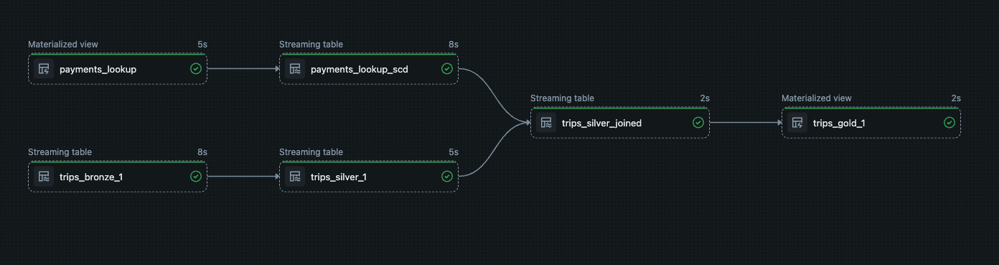

# NYC Taxi Medallion Pipeline (Databricks DLT)

A production-style ETL pipeline built with **Databricks Delta Live Tables (DLT)** that processes NYC Yellow Taxi trip data from an S3 source through a Bronze → Silver → Gold medallion architecture. The pipeline runs on **serverless compute** and completes in ~1m 31s.

---

## Architecture Overview



---

## Tables

| Table | Type | Layer | Description |
|---|---|---|---|
| `trips_bronze_1` | Streaming Table | Bronze | Raw taxi trips ingested from S3 via Auto Loader with enforced schema and `_rescue_data` column |
| `trips_silver_1` | Streaming Table | Silver | Cleaned trips: selects `VendorID`, `payment_type`, `total_amount`, derives `trip_month` from dropoff timestamp. Enforces 2 DQ expectations |
| `trips_silver_joined` | Streaming Table | Silver | Joins `trips_silver_1` with `payments_lookup_scd` on `payment_type` (left join) to enrich with `payment_description` |
| `trips_gold_1` | Materialized View | Gold | Groups by `trip_month`, `payment_type`, `payment_description` — aggregates `sum(total_amount)`. Output: 54 records |
| `payments_lookup` | Materialized View | Dimension | Seeded from `dimensions.py`: 6 payment type codes (Credit Card, Cash, No Charge, Dispute, Unknown, Voided Trip) |
| `payments_lookup_scd` | Streaming Table | CDC | SCD Type 2 history of `payments_lookup`, tracked via `dp.create_auto_cdc_from_snapshot_flow()` keyed on `payment_type` |

---

## Data Quality

Defined in `utilities/rules.py` and loaded via `get_rules('validity')`. Applied to `trips_silver_1` using `@dp.expect_all()`.

| Rule | Logic |
|---|---|
| `correct_data_type` | `VendorID` NOT NULL & numeric; `payment_type` NOT NULL & numeric; `total_amount` numeric; `trip_month` matches `YYYY-MM-DD` format |
| `valid_payment_type` | `payment_type` is numeric AND `BETWEEN 1 AND 5` |

Failed records are tracked but not dropped (warn mode).

---

## Project Structure

```
simple_pipeline_project/
├── transformations/
│   ├── my_transformation.py   # All DLT table definitions (Bronze, Silver, Gold, CDC)
│   └── dimensions.py          # Seeds the payments_lookup Delta table
├── utilities/
│   ├── utils.py               # get_pipeline_schema() — explicit 17-field NYC Taxi schema
│   │                          # get_rules(tag) — loads DQ rules filtered by tag
│   ├── rules.py               # Data quality rules dict with 'validity' tag
│   └── __init__.py
├── tests/
│   ├── test_functions.py      # Unit tests for transformation logic
│   └── run_unit_tests.py      # Test runner
├── explorations/              # Ad-hoc notebooks for data exploration
└── README.md
```

---

## Schema (Bronze)

Explicitly defined in `utilities/utils.py` — not inferred. Key fields:

`VendorID`, `tpep_pickup_datetime`, `tpep_dropoff_datetime`, `passenger_count`, `trip_distance`, `payment_type`, `fare_amount`, `tip_amount`, `tolls_amount`, `total_amount`, `congestion_surcharge`, `Airport_fee`, `cbd_congestion_fee` (+ rescue column)

---

## Tech Stack

- **Platform:** Databricks (Free Edition), Serverless Compute
- **Framework:** Delta Live Tables (DLT) — `pyspark.pipelines`
- **Language:** Python / PySpark
- **Storage:** AWS S3 (source), Delta Lake (output)
- **Ingestion:** Auto Loader (CloudFiles)
- **CDC:** `dp.create_auto_cdc_from_snapshot_flow()` — SCD Type 2
- **Schema:** `workspace.best_pipeline`
- **Last successful run:** Feb 13, 2026 — 1m 31s, 0 errors, 0 warnings
